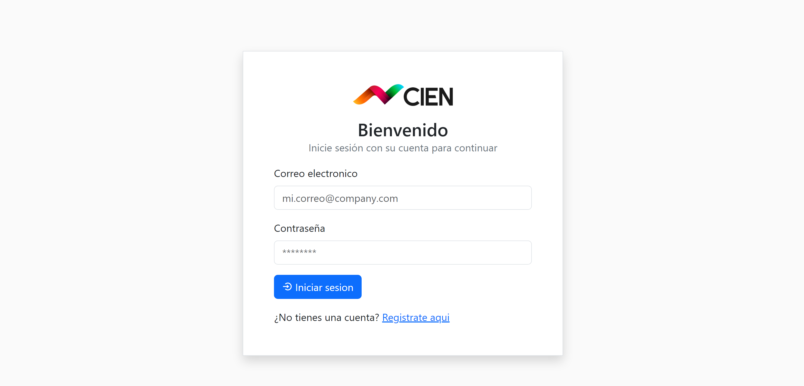
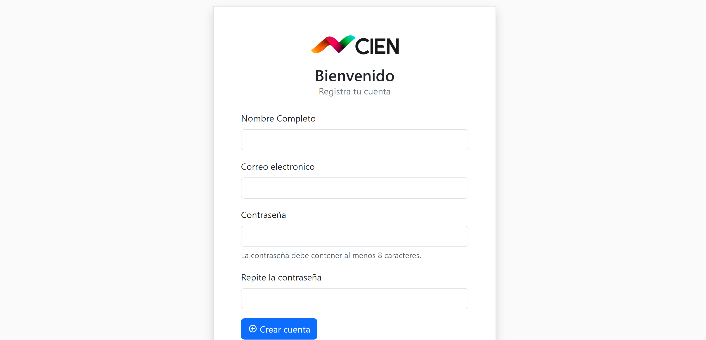
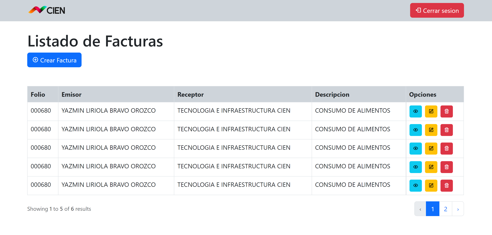
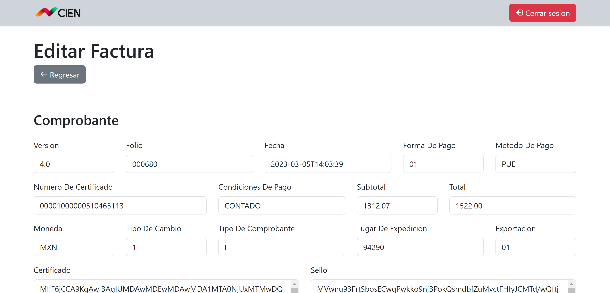
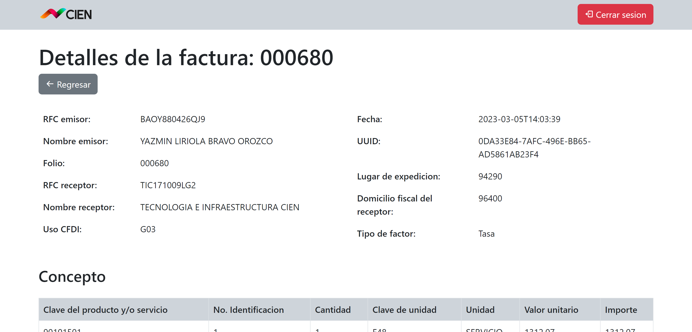

# TICIEN-SYSTEM

Sistema para capturar facturas generadas en el SAT y obtener un visualizador histórico de los archivos. Tecnologías utilizadas: PHP, Laravel, JavaScript y MySql.

## Requisitos previos para instalar el sistema

Para poder instalar este sistema se requiere que previamente tengas instalado [Composer](https://getcomposer.org/) y [Nodejs](https://nodejs.org/es) de manera global en tu equipo.

También se requiere tener instalado un entorno de desarrollo local, puede ser [Laragon](https://laragon.org/) o [XAMPP](https://www.apachefriends.org/es/index.html).

## Pasos para ejecutar localmente

Clonar el proyecto abriendo una terminal en tu equipo y ejecutar el siguiente código:

```bash
  git clone https://github.com/TECNOLOGIA-E-INFRAESTRUCTURA-CIEN/EXAMEN-CFDI.git
```

Abrir la carpeta generada del proyecto:

```bash
  cd EXAMEN-CFDI
```

Una vez ubicado en la carpeta del proyecto, ejecutar el siguiente código para instalar todas las dependencias necesarias:

```bash
  composer install
```

Abrir el proyecto en tu editor de código favorito y crear un archivo en la raíz con el siguiente nombre:

```bash
  .env
```

-   Copiar el contenido del archivo `.env.example` en el archivo `.env` recién creado.

-   De toda la información copiada, lo más importante es modificar los datos para conectarse a la base de datos. Aquí asignan el nombre de la base de datos, el usuario y contraseña en el archivo `.env`.

```
DB_CONNECTION=mysql
DB_HOST=127.0.0.1
DB_PORT=3306
DB_DATABASE=laravel
DB_USERNAME=root
DB_PASSWORD=
```

Laravel necesita una clave única para nuestros proyectos. La generaremos usando el comando:

```bash
  php artisan key:generate
```

Ejecuta las migraciones con el siguiente comando:

```bash
  php artisan migrate
```

Inicia el servidor local con el siguiente comando:

```bash
  php artisan serve
```

Después de iniciar el servidor local, puedes abrir un navegador web e ingresar la siguiente URL para acceder al proyecto:

```bash
  http://127.0.0.1:8000
```

## Capturas de Pantalla









